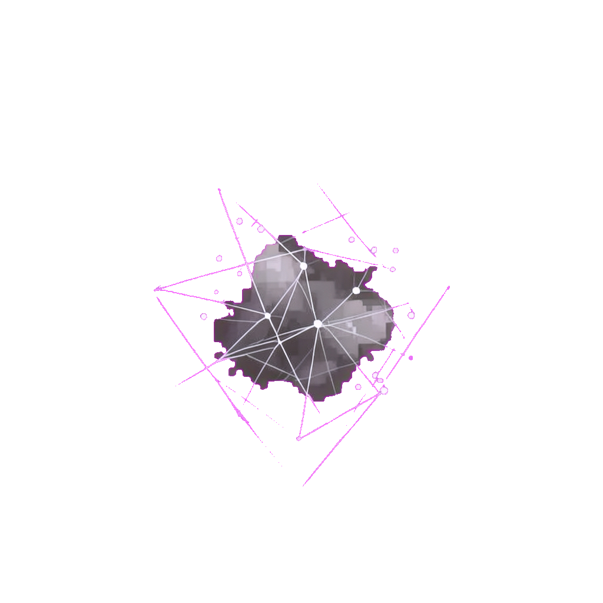

# JungHyeon

I like understanding how things work—and making them simpler.

Reading code, questioning decisions, and learning by changing things.

---

<!--START_SECTION:digital-life-->

## still becoming.

A digital life shaped by your choices.

**BIT** · ever-evolving · **curious** · `DAY 028`

Growth **3** · **89 XP** · next growth at **96 XP** · drawn to **insight**

> The ground ends here. Apparently the possibilities do not.

Today — **A stream of light runs above the broken ground.**

[Read the encounter & vote →](https://github.com/fabric0de/fabric0de/issues/28)

Daily at 08:00 UTC

[Growth album](./docs/creature-album.md) · [Journey log](./docs/journey-log.md) · [How it works](./docs/game.md)

<!--END_SECTION:digital-life-->
