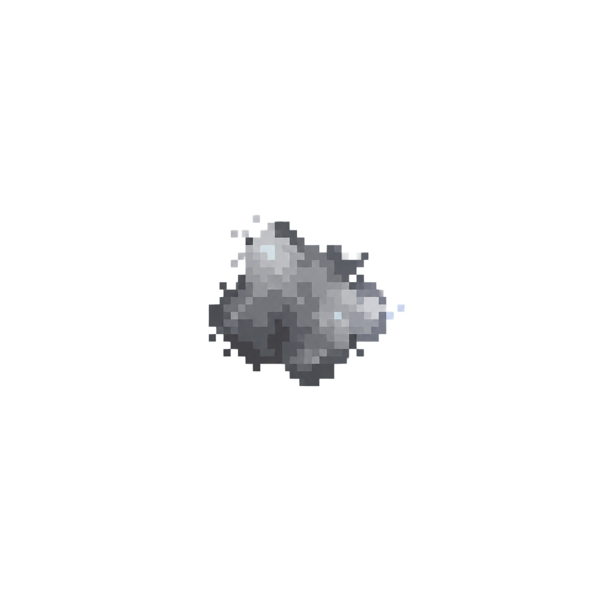

# BIT's growth album

Every appearance below was generated by AI. Its memories connect the appearances: no fixed palette, anatomy, emblem or species. Each new appearance starts from the immediately preceding one.

[Back to the profile](../README.md) · [Journey log](./journey-log.md) · [Growth rules](./game.md#growth-and-appearance)

8 completed encounters · 26 XP · growth 1 · curious

Learned tendencies: exploration 1 · resolve 3 · resonance 6 · insight 6.

A new portrait is pending. Experience keeps accumulating; the last accepted appearance stays visible.

## Awakening — 0 completed encounters

A tiny, unformed cluster of data. No established face, anatomy, emblem or species. Its current neutral colors are not a permanent identity. Selected before the journey began.

0 XP · [Generation prompt](../assets/creature/birth-unformed.prompt.txt)
