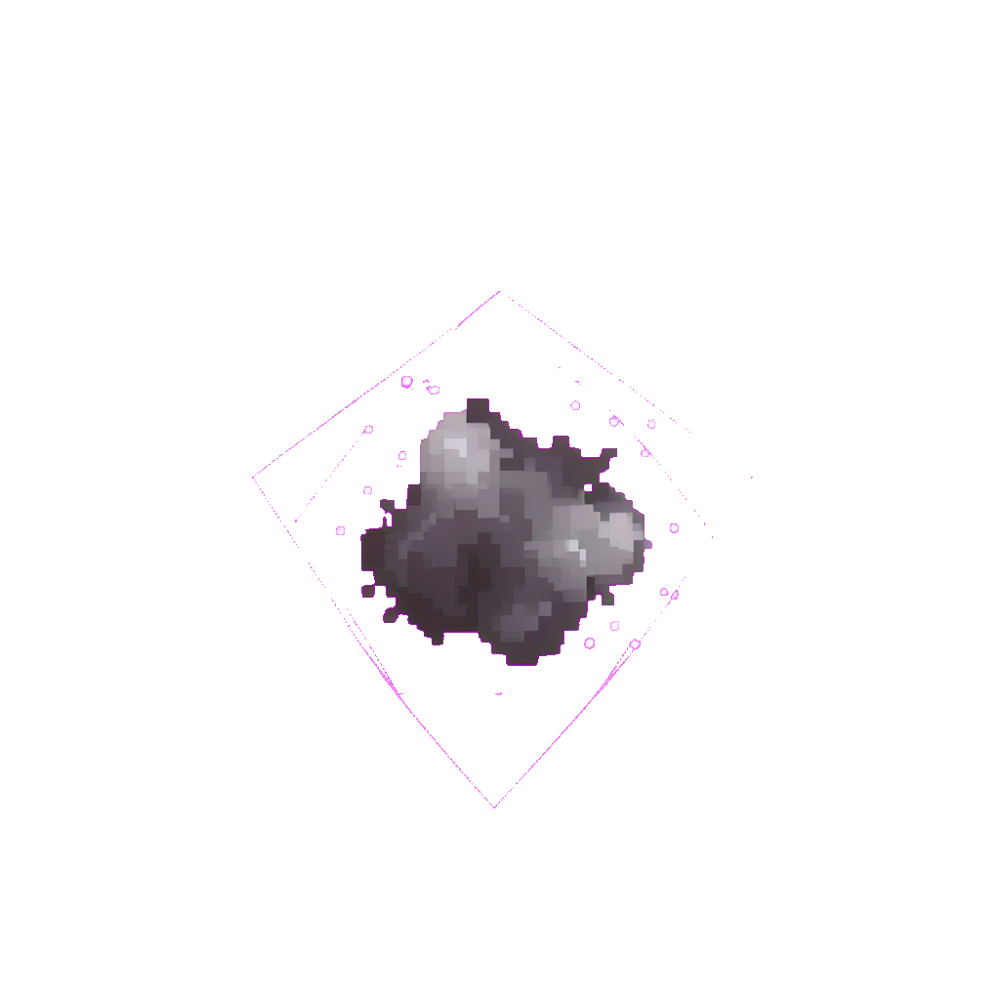
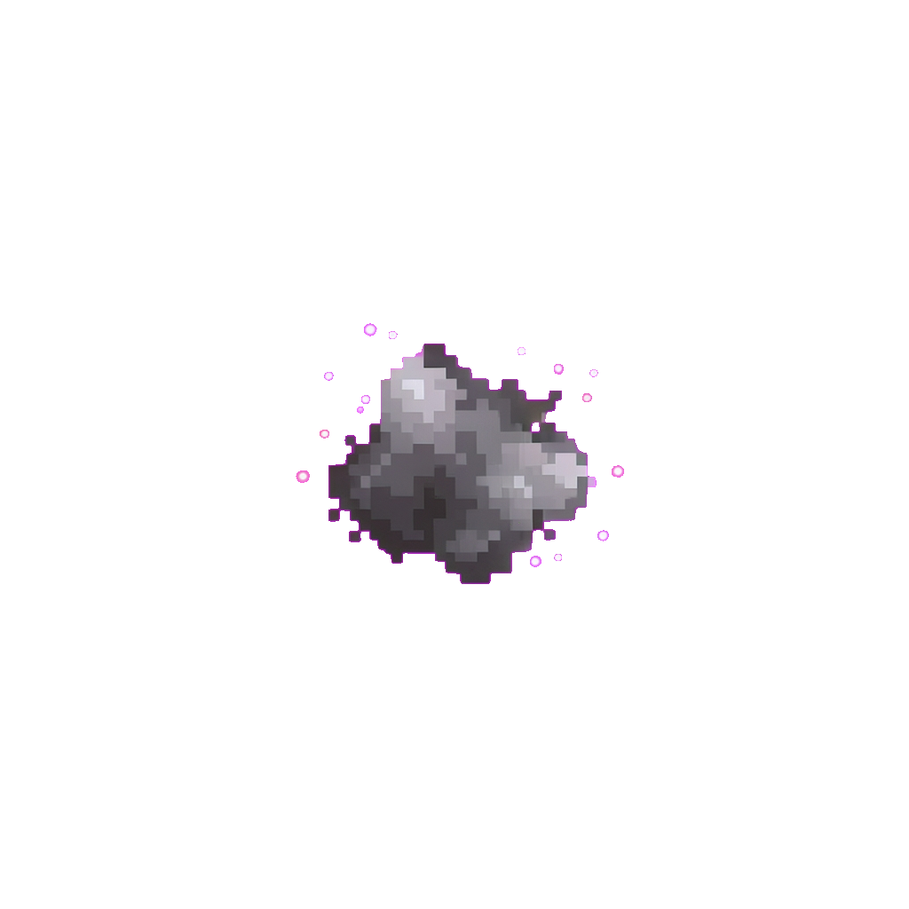
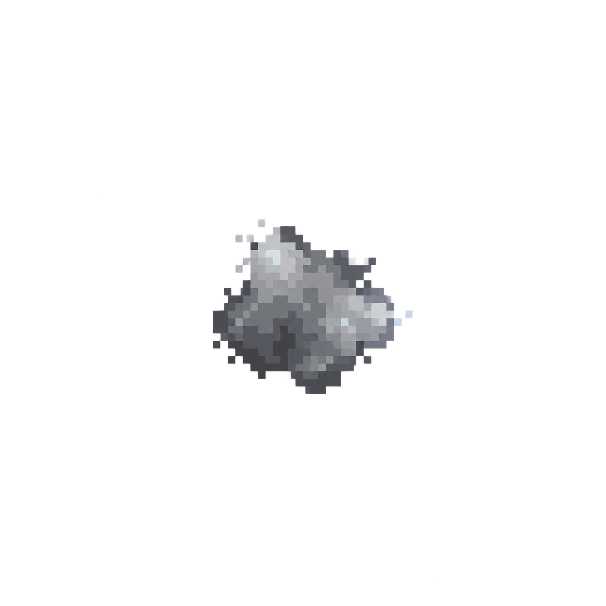

# BIT's growth album

Every appearance below was generated by AI. Its memories connect the appearances: no fixed palette, anatomy, emblem or species. Each new appearance starts from the immediately preceding one.

[Back to the profile](../README.md) · [Journey log](./journey-log.md) · [Growth rules](./game.md#growth-and-appearance)

23 completed encounters · 77 XP · growth 3 · curious

Learned tendencies: exploration 8 · resolve 11 · resonance 11 · insight 16.

A new portrait is pending. Experience keeps accumulating; the last accepted appearance stays visible.

## Growth 2 — 15 completed encounters

Learning the Aegis ability and the resonance gained from sharing fragments suggest the core is beginning to manifest a protective boundary.

**Changed:** Surround the core with a faint, translucent geometric outline.

**Carried forward:** The dark grey amorphous core shape

**Memories behind this change:** days 10, 15.

49 XP · [Generation prompt](../assets/creature/growth-2-0b348e5a2742.prompt.txt) · 1 earlier appearance reference(s)

## Growth 1 — 8 completed encounters

The high resonance and insight gained from studying luminous patterns and exchanging rhythmic signals suggest the amorphous core is beginning to organize into a structured, pulsing entity.

**Changed:** Add small, rhythmic, glowing light-points that appear to pulse within or around the core.

**Carried forward:** The dark grey amorphous core shape.

**Memories behind this change:** days 2, 3, 6, 7, 8.

26 XP · [Generation prompt](../assets/creature/growth-1-f6b769670c20.prompt.txt) · 1 earlier appearance reference(s)

## Awakening — 0 completed encounters

A tiny, unformed cluster of data. No established face, anatomy, emblem or species. Its current neutral colors are not a permanent identity. Selected before the journey began.

0 XP · [Generation prompt](../assets/creature/birth-unformed.prompt.txt)
